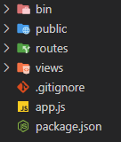

# Prerequisite

You must have Node Package Manager and Node.js installed on your local machine. Installation instructions can be found here: [https://docs.npmjs.com/downloading-and-installing-node-js-and-npm](https://docs.npmjs.com/downloading-and-installing-node-js-and-npm) See **OS X or Windows Node Installers**

# Setup MySQL Table

**Steps taken and modified from** [https://www.sammeechward.com/connect-to-mysql-from-node](https://www.sammeechward.com/connect-to-mysql-from-node)

- Installing MySQL: [https://www.youtube.com/watch?v=u96rVINbAUI](https://www.youtube.com/watch?v=u96rVINbAUI)
    - The root password you make will be written and saved into a .env file later on so make it non-peronsal
- Once you have MySQL installed, you should be able to access the database through MySQL workbench or terminal. I'm going to access MySQL through terminal, but you can use whichever one you prefer.
- In terminal you can access the mysql cli as root by typing in `mysql -u root -p`
- Then you can type `show databases;` to see which databases you already have.
- Create a new database and table with the code below:

```sql
CREATE DATABASE hub_api;
USE hub_api;

CREATE TABLE sensors (
	id integer PRIMARY KEY AUTO_INCREMENT,
	sensor VARCHAR(255) NOT NULL,
	data float NOT NULL,
	created TIMESTAMP NOT NULL DEFAULT NOW() 
);

```

# Setup `hub-api`

- clone this repository to your local computer: `git clone https://github.com/standeraumich/ece574_hub-api.git`
- In an IDE of choice (I’m using VSCode) open the `ece574_hub-api` so your working directory looks like this:
    
    
    
- create a new file in the directory called `.env`
- Open the file and past the following into it:

```sql
HOST = 'localhost'
MYSQL_HOST='localhost'
MYSQL_USER='root'
MYSQL_PASSWORD='DB PASSWORD'
MYSQL_DATABASE='hub_api'
```

- Replace `DB PASSWORD` with your mysql password with your root user
- If needed, change `localhost` to your local computer’s IP Address
- Save and close the `.env` file. The `.env` should exist in the same location as `app.js`, `package.json`, and others
- In a terminal window at the same `ece574_hub-api` location, run the command `npm install`
- Then, run the command: `npm start`
- If your `MySQL` database and `hub-api` have been setup correctly, You should be able to post sensor data to the api but running this python code:

```python
import requests 

url = 'http://localhost:3001/sensors'
myobj = {'sensor': 'test sensor',
         'data':400}

x = requests.post(url, json = myobj)

print(x.text)
```

- You should be able to view all the sensor data by going into a browser and putting in the address: `http://localhost:3001/sensors` and viewing the latest sensor data by going to: `http://localhost:3001/sensors/latest`